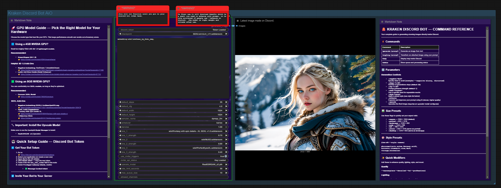
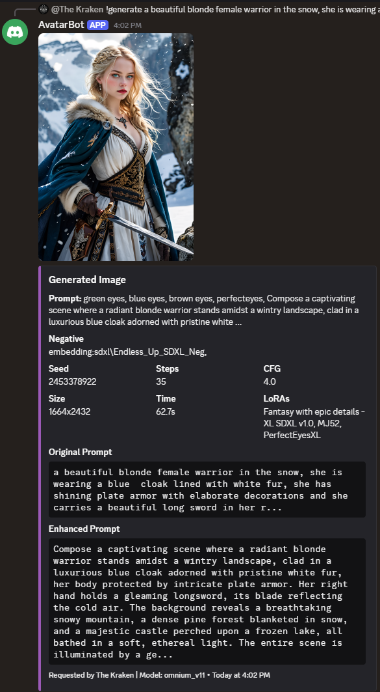
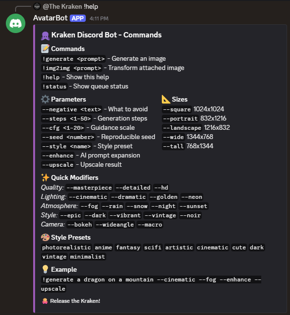

# Kraken Discord Bot

A standalone ComfyUI custom node that turns your ComfyUI instance into a Discord image generation bot. No complex workflows needed - just one node that handles everything!



## Features

- **All-in-One Node**: Single node handles Discord bot, image generation, and response
- **Simple Setup**: Just add your Discord token, select a model, and queue
- **Discord Commands**: Users can generate images with `!generate <prompt>`
- **LoRA Support**: Up to 3 LoRAs with automatic CivitAI trigger word fetching
- **Upscale Models**: Optional upscaling with RealESRGAN or other models
- **AI Prompt Enhancement**: `--enhance` flag uses Qwen2-VL to expand simple prompts
- **Style Presets**: Built-in styles (anime, photorealistic, fantasy, etc.)
- **Quick Modifiers**: Instant quality/lighting/atmosphere tags (`--cinematic`, `--fog`, etc.)
- **Size Presets**: Easy aspect ratios (`--portrait`, `--landscape`, `--wide`, etc.)
- **Parameter Control**: Users can customize steps, CFG, size, seed via flags
- **Rate Limiting**: Configurable per-user cooldown to prevent spam
- **Queue Management**: Handles multiple requests with queue position feedback
- **Persistent Config**: Settings are saved and restored between sessions

## Screenshots

### Discord Result


### Help Menu


## Installation

### Method 1: ComfyUI Manager
1. Open ComfyUI Manager
2. Search for "Kraken Discord Bot"
3. Click Install

### Method 2: Git Clone
```bash
cd ComfyUI/custom_nodes
git clone https://github.com/krakenunbound/kraken-discord-bot.git
cd kraken-discord-bot
pip install -r requirements.txt
```

### Method 3: Download ZIP
1. Download this repository as ZIP
2. Extract to `ComfyUI/custom_nodes/kraken-discord-bot`
3. Install requirements: `pip install discord.py requests`

## Setup

### 1. Create a Discord Bot

1. Go to [Discord Developer Portal](https://discord.com/developers/applications)
2. Click "New Application" and give it a name
3. Go to "Bot" section and click "Add Bot"
4. Under "Privileged Gateway Intents", enable **Message Content Intent**
5. Copy the bot token (you'll need this)

### 2. Invite Bot to Your Server

1. Go to "OAuth2" > "URL Generator"
2. Select scopes: `bot`
3. Select permissions: `Send Messages`, `Embed Links`, `Attach Files`, `Read Message History`
4. Copy the generated URL and open it to invite the bot

### 3. Configure the Node

1. Add the "Kraken Discord Bot (All-in-One)" node to your workflow
2. Paste your Discord token in the `discord_token` field (shows "Token Loaded" once saved)
3. Select a checkpoint model
4. (Optional) Select up to 3 LoRAs - triggers are auto-fetched from CivitAI
5. (Optional) Select an upscale model for `--upscale` support
6. Configure default settings (steps, CFG, size)
7. Queue the workflow - the bot will start and wait for commands!

## Discord Commands

### Generate Images
```
!generate <prompt>
!gen <prompt>
!g <prompt>
```

### Parameter Flags
```
--negative <text>     What to avoid in the image
--steps <1-50>        Number of generation steps (default: 20)
--cfg <1-20>          Guidance scale (default: 7)
--seed <number>       Specific seed for reproducibility
--style <name>        Style preset (see below)
--enhance             Use AI to expand your prompt (slower but better)
--upscale             Upscale the result (if model configured)
```

### Size Preset Flags
```
--square              1024x1024 (default)
--portrait            832x1216
--landscape           1216x832
--wide                1344x768
--tall                768x1344
--phone               832x1216 (same as portrait)
--desktop             1216x832 (same as landscape)
```

### Quick Modifier Flags
Add quality and style enhancements instantly:

| Category | Flags |
|----------|-------|
| Quality | `--masterpiece` `--detailed` `--hd` `--professional` |
| Lighting | `--cinematic` `--dramatic` `--soft` `--golden` `--neon` `--backlit` |
| Atmosphere | `--fog` `--mist` `--rain` `--snow` |
| Time | `--night` `--day` `--sunset` `--dawn` |
| Style | `--epic` `--dark` `--vibrant` `--muted` `--vintage` `--noir` |
| Camera | `--bokeh` `--dof` `--wideangle` `--macro` |
| Artistic | `--painterly` `--ethereal` `--gritty` `--clean` |

### Style Presets
Use with `--style <name>`:
- `photorealistic` - Realistic photo style
- `anime` - Anime/manga style
- `fantasy` - Epic fantasy art
- `scifi` - Science fiction
- `artistic` - Painterly style
- `cinematic` - Movie-like shots
- `cute` - Adorable kawaii style
- `dark` - Dark and moody
- `vintage` - Retro aesthetic
- `minimalist` - Clean and simple

### Examples
```
!generate a majestic dragon flying over mountains --cinematic --fog --masterpiece
!gen cyberpunk city at night --style scifi --neon --rain --wide
!g anime girl with sword --style anime --portrait --detailed
!generate cute cat playing --soft --vibrant --bokeh
!generate epic battle scene --enhance --upscale
```

### Other Commands
```
!help    - Show help message with all options
!status  - Show bot status and queue
```

## Node Settings

| Setting | Description | Default |
|---------|-------------|---------|
| discord_token | Your Discord bot token | (required) |
| checkpoint | Model to use for generation | (required) |
| default_negative | Default negative prompt | ugly, blurry... |
| default_steps | Default generation steps | 20 |
| default_cfg | Default CFG scale | 7.0 |
| default_width | Default image width | 1024 |
| default_height | Default image height | 1024 |
| sampler_name | Sampler to use | euler_ancestral |
| scheduler | Scheduler to use | normal |
| lora_1/2/3 | Optional LoRA models | None |
| lora_X_strength | LoRA strength | 1.0 |
| use_civitai_triggers | Auto-fetch trigger words | True |
| upscale_model | Upscale model for --upscale | None |
| rate_limit_seconds | Cooldown between requests per user | 30 |
| max_queue_size | Maximum pending requests | 10 |
| allowed_channels | Restrict to specific channel IDs | (all) |

## Troubleshooting

### Bot not responding
- Make sure "Message Content Intent" is enabled in Discord Developer Portal
- Check that the bot has permissions in the channel
- Verify the token is correct

### Generation errors
- Ensure you have a valid checkpoint selected
- Check ComfyUI console for error messages
- Make sure you have enough VRAM

### --enhance not working
- Requires `transformers` and `accelerate` libraries
- **Standard install:** `pip install transformers accelerate`
- **Portable ComfyUI:** `.\python_embeded\python.exe -m pip install transformers accelerate`
- First use downloads Qwen2-VL-2B (~4GB)
- Needs additional VRAM (unloads after enhancement)

### --upscale not working
- Select an upscale model in the node settings
- Requires `spandrel` library
- **Standard install:** `pip install spandrel`
- **Portable ComfyUI:** `.\python_embeded\python.exe -m pip install spandrel`

## Requirements

- ComfyUI (latest version recommended)
- Python 3.10+
- discord.py >= 2.0
- requests
- transformers + accelerate (optional, for --enhance)
- spandrel (optional, for --upscale)
- A Discord bot token
- GPU with sufficient VRAM for your chosen model

## Changelog

### v1.1.0 (2024-12-09)
- **LoRA Support**: Added 3 LoRA slots with automatic CivitAI trigger word fetching
- **Upscale Models**: Added `--upscale` flag for on-demand upscaling
- **AI Prompt Enhancement**: Added `--enhance` flag using Qwen2-VL-2B
- **Size Preset Flags**: Direct flags like `--portrait`, `--landscape`, `--wide`
- **Quick Modifiers**: 30+ modifier flags for instant quality/style boosts
- **Improved Help**: Help command now uses Discord embed (prettier + no char limit)
- **Bug Fixes**: Fixed parser bug where multiple boolean flags wouldn't parse correctly
- **Single Token Field**: Simplified token input (shows "Token Loaded" when saved)

### v1.0.0 (2024-12-08)
- Initial release
- All-in-one Discord bot node
- Basic generation with style presets
- Rate limiting and queue management

## License

MIT License - feel free to use, modify, and distribute!

## Credits

- Built for ComfyUI
- Uses discord.py for Discord integration
- Qwen2-VL-2B for prompt enhancement
- Kraken theme styling included

---

Made with love for the AI art community!
